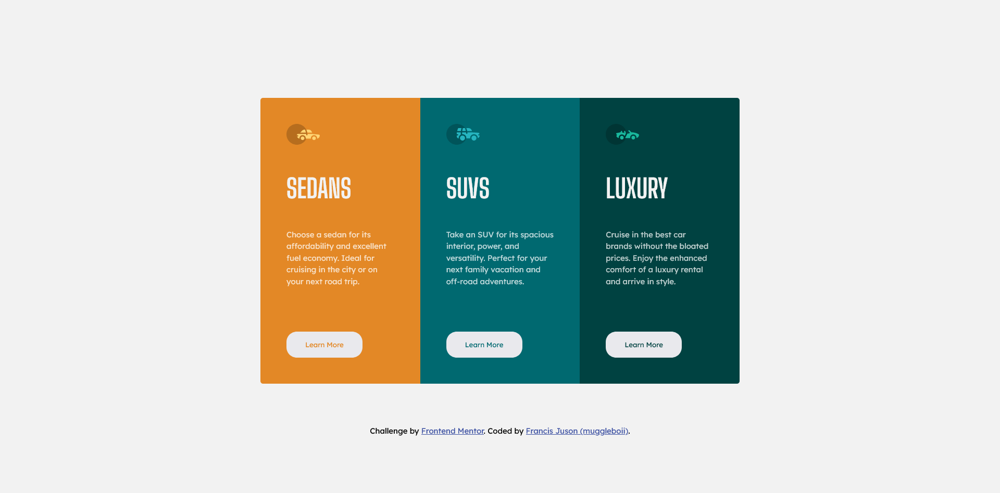
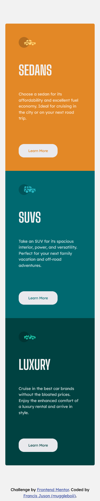

# Frontend Mentor - 3-column preview card component solution

This is a solution to the [3-column preview card component challenge on Frontend Mentor](https://www.frontendmentor.io/challenges/3column-preview-card-component-pH92eAR2-). Frontend Mentor challenges help you improve your coding skills by building realistic projects. 

## Table of contents

- [Overview](#overview)
  - [The challenge](#the-challenge)
  - [Screenshot](#screenshot)
  - [Links](#links)
- [My process](#my-process)
  - [Built with](#built-with)
  - [What I learned](#what-i-learned)

- [Author](#author)

## Overview
This is my solution to the 3-column preview card component. It took me 1 hour (I think) to code it.

### The challenge

Users should be able to:

- View the optimal layout depending on their device's screen size
- See hover states for interactive elements

### Screenshot

### Links

- Solution URL: [Solution URL](https://github.com/muggleboii/3-column-preview-card-component-frontend-mentor)
- Live Site URL: [Live site URL](https://muggleboii.github.io/3-column-preview-card-component-frontend-mentor/)

## My process

### Built with

- HTML
- CSS

### What I learned
My knowledge about the difference about each position(property) in css just dove deeper after completing this project.

## Author

- Website - [Francis Juson (Muggleboii)](https://github.com/muggleboii)
- Frontend Mentor - [@muggleboii](https://www.frontendmentor.io/profile/muggleboii)
